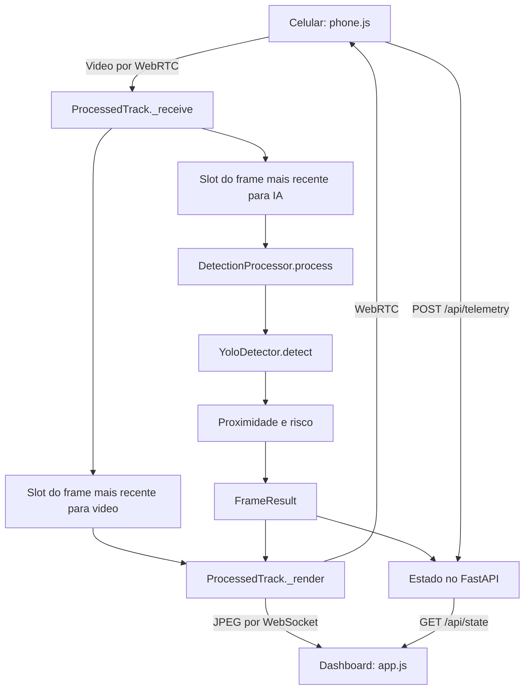
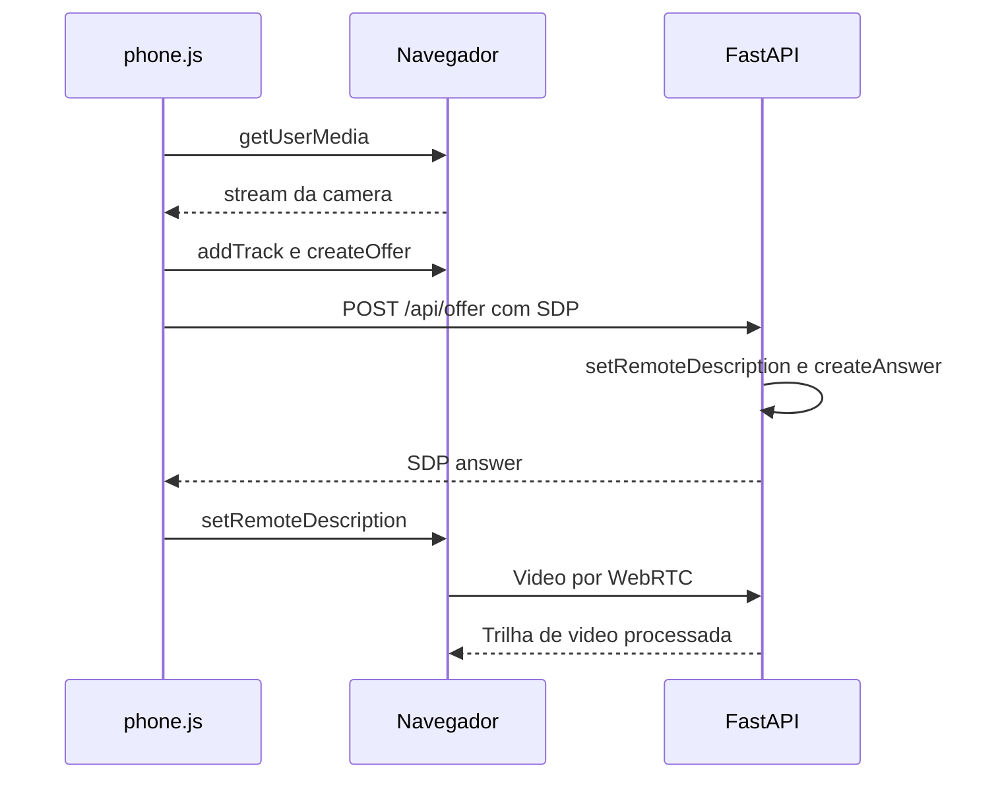

# Documentação do código — Visão do Agro / AgroSafe Vision

Este guia explica o código da aplicação, do treinamento e dos testes, conforme
os arquivos presentes no repositório em 14/09/2026. Foi escrito para quem vai
estudar, apresentar ou modificar o projeto. Os links abrem os arquivos explicados.

Para executar o sistema, consulte o [README principal](../README.md).
Para preparar imagens e treinar, consulte o [guia de treinamento](../training/README.md).

## Índice

1. [Visão geral e vocabulário](#1-visao-geral)
2. [Mapa dos arquivos](#2-arquivos)
3. [Inicialização e certificados](#3-inicializacao)
4. [Servidor e API](#4-servidor)
5. [Recepção e processamento de vídeo](#5-video)
6. [Detector e carregamento de pesos](#6-detector)
7. [Composição das detecções](#7-processamento)
8. [Proximidade, risco e overlay](#8-proximidade-risco)
9. [Configurações e presets](#9-configuracoes)
10. [Contratos de dados](#10-dados)
11. [Dashboard](#11-dashboard)
12. [Câmera do celular](#12-celular)
13. [Treinamento separado do runtime](#13-treinamento)
14. [Testes](#14-testes)
15. [Dependências e arquivos locais](#15-dependencias)
16. [Como modificar e investigar problemas](#16-manutencao)

<a id="1-visao-geral"></a>
## 1. Visão geral e vocabulário

O celular fornece vídeo e localização. O notebook recebe o vídeo, executa o modelo
YOLO, acompanha os objetos, calcula um indicador visual de proximidade e classifica
o risco. O dashboard mostra o resultado e emite sons no próprio navegador.

Há dois processos distintos:

- **Inferência/runtime:** usar pesos existentes para reconhecer objetos ao vivo.
- **Treinamento:** usar imagens anotadas para produzir novos pesos. Pode acontecer
  em outra máquina; depois basta trazer o arquivo `.pt` para este projeto.

| Termo | Significado neste código |
|---|---|
| Frame | Uma imagem de uma sequência de vídeo |
| Modelo/pesos | Rede e parâmetros carregados pelo Ultralytics a partir de um `.pt` |
| Bounding box / bbox | Retângulo ao redor de um objeto; no runtime, `[x1, y1, x2, y2]` em pixels |
| Confidence | Confiança do detector na classificação; não é proximidade nem risco |
| Tracking | Associação de observações sucessivas ao mesmo ID de objeto |
| Overlay | Caixas, corredor e textos desenhados sobre a imagem |
| WebRTC | Conexão de mídia entre navegador do celular e servidor Python |
| SDP | Descrição trocada para negociar essa conexão de mídia |
| WebSocket | Conexão usada aqui para entregar JPEGs e, opcionalmente, estados em JSON |
| Event loop | Laço que atende tarefas assíncronas de rede sem esperar uma tarefa por vez terminar |
| Worker de inferência | Trabalho serial que executa o processamento pesado fora do event loop |
| Preset | Conjunto de valores escolhido por um nome, como BALANCED |
| Latência | Tempo até uma etapa produzir o resultado; não é a mesma coisa que FPS |



O dashboard atual não recebe uma conexão WebRTC própria: recebe JPEGs por
`/ws/video`. A trilha WebRTC processada é devolvida ao celular.

<a id="2-arquivos"></a>
## 2. Mapa dos arquivos

| Arquivo | Responsabilidade |
|---|---|
| [app.py](../app.py) | FastAPI, rotas, estado da missão e integração dos componentes |
| [config.py](../config.py) | Valores padrão, presets e validação das configurações |
| [models.py](../models.py) | Estruturas Pydantic de detecção, telemetria, evento e PATCH |
| [video_pipeline.py](../video_pipeline.py) | Recepção contínua, descarte de frames, inferência assíncrona e saída de vídeo |
| [detector.py](../detector.py) | Adaptador do YOLO: pesos, device, classes e caixas estruturadas |
| [processing.py](../processing.py) | Une detecção, proximidade e risco em um resultado |
| [proximity.py](../proximity.py) | Score visual e taxa de aproximação por ID |
| [risk.py](../risk.py) | Corredor, nível candidato de risco e confirmação temporal |
| [overlay.py](../overlay.py) | Desenho de caixas, corredor e legendas |
| [frontend/index.html](../frontend/index.html) | Estrutura do dashboard e formulário de configurações |
| [frontend/app.js](../frontend/app.js) | Atualização do dashboard, sons, vídeo e configurações |
| [frontend/phone.html](../frontend/phone.html) | Estrutura da tela do celular |
| [frontend/phone.js](../frontend/phone.js) | Permissões, seleção da câmera, negociação WebRTC e GPS |
| [frontend/styles.css](../frontend/styles.css) | Tema visual, componentes e adaptação a telas menores |
| [start.bat](../start.bat) | Inicialização do servidor no Windows |
| [generate_cert.py](../generate_cert.py) | Geração de chave e certificado HTTPS local |
| [treinar.bat](../treinar.bat) | Atalho Windows para o treinamento e sua conferência |
| [training/train.py](../training/train.py) | Argumentos, verificação prévia, treinamento e avaliação |
| [training/dataset.py](../training/dataset.py) | Leitura do YAML e inspeção de imagens/labels |
| [datasets/obstaculos/data.yaml](../datasets/obstaculos/data.yaml) | Classes e pastas de treino, validação e teste |
| [tests/test_logic.py](../tests/test_logic.py) | Testes originais da lógica de segurança |
| [tests/test_runtime.py](../tests/test_runtime.py) | Testes de configurações, detector, pipeline e API |
| [tests/test_webrtc.py](../tests/test_webrtc.py) | Transmissão local WebRTC com detector simulado |
| [tests/test_training.py](../tests/test_training.py) | Conferência de datasets sem treinar uma rede |
| [requirements.txt](../requirements.txt) | Dependências Python declaradas |
| [.gitignore](../.gitignore) | Exclusão de ambientes, dados e resultados locais do Git |

`__init__.py` na raiz, em `tests/` e em `training/` identifica pacotes Python;
esses arquivos não iniciam o servidor nem o treinamento. Os arquivos `.gitkeep`
mantêm as pastas vazias do dataset versionadas. Os READMEs da raiz, de `training/`
e de `models/` orientam operação e organização; não são executados.

**`models.py` e `models/` são coisas diferentes:** o primeiro define contratos
Python; a pasta recebe pesos como um futuro `best.pt`. O genérico `yolo11n.pt`
permanece na raiz. Não existe implementação da rede neural em `phone.js`.

<a id="3-inicializacao"></a>
## 3. Inicialização e certificados

### `start.bat`

O script muda para a pasta onde está salvo, procura um processo escutando na porta
8000 e encerra com uma mensagem se encontrar um. Essa verificação não identifica
se o processo é realmente o AgroSafe Vision.

Se a porta estiver livre:

1. Confere se `python` está no PATH.
2. Cria `.venv` se `.venv/Scripts/python.exe` não existir.
3. Usa esse Python para instalar `requirements.txt`.
4. Interrompe com `Dependency installation failed` se o pip falhar.
5. Cria `.certs` e executa `generate_cert.py` quando `cert.pem` não existir.
6. Inicia `uvicorn app:app --host 0.0.0.0 --port 8000`, com opções SSL se encontrar o certificado.

`app:app` significa: importar o módulo `app.py` e servir o objeto FastAPI chamado
`app`. O launcher só verifica a existência do Python da `.venv`, não sua validade:
um ambiente copiado de outro computador pode existir e estar quebrado.

### `generate_cert.py`

- `ROOT`, `CERTS`, `CERT` e `KEY` definem os destinos dos arquivos.
- `local_ip()` consulta o endereço de saída de um socket UDP e usa `127.0.0.1`
  como alternativa em caso de erro. Não envia imagens por esse socket.
- `main()` gera uma chave RSA de 2048 bits e um certificado autoassinado, assinado
  com SHA-256, válido até 365 dias após a geração, incluindo o IP local e `localhost`.
- Grava a chave privada em `.certs/key.pem` e o certificado em `.certs/cert.pem`.

O gerador usa `cryptography`. A mensagem do launcher que menciona OpenSSL/mkcert
é antiga: essa não é uma dependência do gerador atual. O launcher testa somente
`cert.pem` ao escolher SSL; `app.py` exige certificado e chave para montar URLs HTTPS.
Se um dos arquivos faltar, é necessário restaurar o par. Se o IP mudar, o certificado
não é renovado automaticamente. A chave privada não deve ser incluída no Git.

Executar `python app.py` também inicia o Uvicorn, mas o bloco final do arquivo não
inclui as opções HTTPS. Para a demonstração com celular, use o launcher documentado.

<a id="4-servidor"></a>
## 4. Servidor e API — `app.py`

### Estado compartilhado

O módulo cria um `YoloDetector`, a configuração ativa `settings`, o dicionário
`tracks` e o dicionário `state`. O modelo ainda não é carregado nesse momento.

| Estado | Conteúdo |
|---|---|
| `tracks` | Associação da conexão WebRTC à sua `ProcessedTrack` |
| `state['pcs']` | Conexões WebRTC ativas ou em negociação |
| `state['video_clients']` | Slots de JPEG dos dashboards conectados |
| `state['detections']` | Últimas detecções serializadas |
| `state['telemetry']` | Último objeto `Telemetry` recebido |
| `state['events']` | `deque(maxlen=100)`, com os eventos mais novos primeiro |
| `state['last_alert']` | Último nível e instante de alerta por ID |
| `state['metrics']` | Métricas publicadas na conclusão do processamento |
| Flags de conexão | Estado de telefone, câmera, stream, GPS e sensores |
| `mission_started`, `alert_count` | Início do contador e quantidade de eventos HIGH/CRITICAL |

Tudo fica em memória e se perde ao reiniciar. A aplicação tem estado global de
uma missão e admite uma câmera ativa. Não há isolamento de sessões por usuário
nem sincronização desse estado entre múltiplos processos Uvicorn.

### Funções de integração

| Função | O que faz |
|---|---|
| `lifespan()` | No encerramento da aplicação, fecha os peers e slots dos espectadores |
| `disable_frontend_cache()` | Adiciona `Cache-Control: no-store` às respostas de `/static/` |
| `local_ip()` | Obtém o IP usado para compor os links de conexão |
| `add_event()` | Cria `Event`, insere no histórico e incrementa alertas HIGH/CRITICAL |
| `publish_result()` | Publica caixas e métricas, atualiza resolução e gera eventos de risco |
| `publish_error()` | Limpa as detecções e registra indisponibilidade da IA |
| `snapshot()` | Monta o estado público, remove resultados vencidos e escolhe a ameaça principal |
| `close_peer()` | Aguarda fechamento da trilha, remove a conexão e limpa o estado de vídeo quando não resta peer |

`publish_result()` gera eventos para MEDIUM/HIGH/CRITICAL quando o nível muda
ou o cooldown passou. Um mesmo objeto pode gerar mais de um evento ao longo do
tempo. `alert_count` não é a quantidade de objetos únicos.

`snapshot()` ordena ameaças pela gravidade numérica de `Risk`, depois pela
proximidade. Ele mantém a latência medida no momento da conclusão, mas recalcula
a idade do resultado e os FPS. Resultados com mais de um segundo ou calculados
com uma configuração substituída não aparecem como detecção ativa.

### Rotas HTTP e WebSocket

| Método e caminho | Função | Entrada / resposta / efeito |
|---|---|---|
| `GET /` | `dashboard()` | Entrega `frontend/index.html` |
| `GET /phone` | `phone()` | Entrega `frontend/phone.html` |
| `GET /static/...` | `StaticFiles` | Arquivos do frontend |
| `GET /api/session` | `session()` | Código fixo `AF-4281`, IP, URL do celular e disponibilidade WebRTC |
| `GET /api/qr` | `qr()` | PNG do QR Code; usa `BytesIO` e `StreamingResponse` |
| `GET /api/state` | `get_state()` | Resultado de `snapshot()` |
| `GET /api/settings` | `get_settings()` | Configuração atual em JSON |
| `GET /api/presets` | `presets()` | Dicionários de presets de desempenho e proximidade |
| `GET /api/model` | `model_info()` | Modelo configurado/carregado, classes, device e recarga pendente |
| `PATCH /api/settings` | `patch_settings()` | Recebe `SettingsPatch`; valida e substitui a configuração |
| `POST /api/telemetry` | `telemetry()` | Recebe `Telemetry`; substitui a amostra anterior |
| `POST /api/mission/start` | `start_mission()` | Reinicia relógio, eventos, contador e histórico de alertas |
| `POST /api/mission/stop` | `stop_mission()` | Registra evento de parada; não pausa relógio ou processamento |
| `POST /api/camera/stop` | `stop_camera()` | Fecha todas as conexões da câmera atual |
| `POST /api/offer` | `offer()` | Recebe SDP offer e devolve SDP answer |
| `GET /api/health` | `health()` | `ok`, utilização de CPU e porcentagem de RAM do sistema |
| `WS /ws/events` | `events()` | Envia um snapshot a cada 0,2 s; não é usado pelo dashboard atual |
| `WS /ws/video` | `video()` | Envia mensagens binárias JPEG ao dashboard |

Exemplo de atualização, com os mesmos campos que o frontend envia:

```json
{"values": {"performance_profile": "QUALITY", "proximity_preset": "FAR"}}
```

Exemplo de resposta de `/api/model` antes do primeiro carregamento:

```json
{
  "configured_model": "yolo11n.pt",
  "loaded_model": null,
  "available_classes": [],
  "missing_classes": [],
  "device": "UNAVAILABLE",
  "pending_reload": true
}
```

### Negociação e fechamento WebRTC

`offer()` retorna 503 quando a integração WebRTC não foi importada, 409 quando
já existe um peer, 422 para tipo/SDP inválido e 400 quando a negociação capturada
pelo `try` falha. Os callbacks locais têm papéis específicos:

- `on_track`: cria a `ProcessedTrack` ao receber a primeira trilha de vídeo e a
  adiciona à conexão como trilha de saída.
- `on_state_change`: chama `close_peer()` em falha, fechamento ou desconexão.

Em `video()`, `send_frames()` consome JPEGs do slot e `receive_disconnect()`
aguarda mensagens/desconexão. Quando uma tarefa termina, o `finally` remove o
cliente, fecha o slot e cancela/aguarda as tarefas restantes. Os clientes não
precisam enviar uma mensagem para receber o primeiro JPEG.

O CORS atual permite todas as origens. As rotas não implementam autenticação.
`AF-4281` é um rótulo de demonstração, não uma credencial ou uma sessão aleatória.
Os links de QR/session pressupõem porta 8000 e inferem HTTP/HTTPS pela existência
dos arquivos de certificado, não pelo protocolo real de cada requisição.

<a id="5-video"></a>
## 5. Recepção e processamento — `video_pipeline.py`

### `LatestFrame`: apenas um item pendente

O construtor guarda `value`, um `asyncio.Event`, a flag `closed` e o contador
`dropped`. `put()` substitui o item pendente e sinaliza o evento. Se já havia item,
incrementa `dropped`. `get()` espera, retira o item e limpa o evento. `close()`
descarta o conteúdo e acorda quem espera, que recebe `MediaStreamError`.

Exemplo: enquanto a IA processa o frame 10, chegam 11, 12 e 13. O slot termina
contendo somente o 13. Quando estiver livre, a IA recebe o 13, sem processar 11 e 12.
Essa classe é acessada pelo event loop; não é uma fila genérica para threads.

Existem slots independentes para renderização, inferência e cada espectador.
Portanto, vídeo e IA podem consumir frames diferentes. `dropped_frames` exposto
na API conta somente substituições no slot de inferência, não perdas na rede.

### `RateMeter` e `ReceivedFrame`

- `RateMeter.__init__()` inicia uma janela temporal; `tick(now)` registra uma
  conclusão; `value(now)` elimina registros com mais de dois segundos e calcula
  conclusões por segundo. No início, usa o tempo transcorrido desde a criação.
- `ReceivedFrame` empacota o frame AV e `received_at`, um instante monotônico
  obtido com `time.perf_counter()`. Não é horário UTC nem timestamp da câmera.

### Métodos de `ProcessedTrack`

| Método | Responsabilidade |
|---|---|
| `__init__()` | Guarda dependências/callbacks, cria processador, slots, medidores e referências das tarefas |
| `_start()` | Inicializa as tarefas uma vez e limpa o tracking da sessão anterior |
| `_receive()` | Consome continuamente `source.recv()` e publica o frame nos dois slots |
| `_infer()` | Espera o limite de frequência, pega o frame mais recente e executa `processor.process` via `asyncio.to_thread` |
| `metrics()` | Retorna tempos, taxas, descartes e dados de execução |
| `_render()` | Converte o frame atual, aplica overlay opcional, recria `VideoFrame` e opcionalmente codifica JPEG |
| `recv()` | Entrada chamada pelo aiortc para obter a trilha de saída; coordena renderização e publicação dos JPEGs |
| `stop()` | Para trilha/fonte, fecha slots e cancela a recepção |
| `aclose()` | Chama `stop()` e aguarda as tarefas ainda existentes |

O limitador espera **antes** de retirar o item do slot. Assim, o frame escolhido
não envelhece durante uma espera artificial. Há uma inferência em execução por vez;
`to_thread` permite que o loop continue recebendo mídia e respondendo HTTP.
Renderização também usa `to_thread`, podendo ocorrer enquanto a IA trabalha.

Cada inferência guarda a referência da configuração recebida. Se o PATCH tiver
substituído esse objeto antes da conclusão, o resultado antigo é descartado.
Erros de processamento limpam o resultado, têm aviso limitado a um a cada cinco
segundos e deixam um intervalo de um segundo antes da próxima tentativa.

`MAX_OVERLAY_AGE = 1.0` impede exibir caixas de um frame com mais de um segundo.
Até esse limite, as caixas são reutilizadas no vídeo atual: o código não extrapola
o movimento do objeto entre inferências. Se a resolução mudar, reescala X/Y das
caixas. Antes de desenhar, copia a imagem para não modificar memória compartilhada
com a entrada da inferência.

`pts` e `time_base` são preservados na saída WebRTC. JPEG tem qualidade 82 e
limite `JPEG_FPS = 12`, e só é gerado se houver espectador. Cada cliente recebe
o JPEG por seu próprio slot; um envio lento não é aguardado dentro de `recv()`.

`asyncio.shield` protege a renderização do cancelamento da espera. `aclose()`
aguarda o processamento que já está em uma thread, pois cancelar uma coroutine
não interromperia com segurança a execução do modelo dentro dela.

### Interpretação exata das métricas

| Campo | O que mede |
|---|---|
| `inference_ms` | YOLO/tracking e conversão das caixas para objetos; normalmente exclui `_load()` |
| `processing_ms` | `DetectionProcessor.process` inteiro, incluindo conversão, carga quando necessária, proximidade e risco |
| `server_detection_ms` | Recepção pela aplicação até publicação; `app.py` conserva o valor registrado na conclusão |
| `result_age_ms` | Tempo atual menos recepção do frame que originou o resultado |
| `ai_fps` | Conclusões publicáveis do processador por segundo, em janela móvel |
| `video_fps` | Frames preparados para a trilha de saída por segundo; não mede apresentação no navegador |
| `overlay_ms` | Conversão BGR e preparação/desenho anterior à construção do frame de saída |
| `jpeg_ms` | Tempo gasto na codificação JPEG; zero quando não houve codificação naquela saída |
| `dropped_frames` | Quantos itens pendentes foram substituídos no slot de inferência |
| `device`, `backend`, `half_precision` | Device efetivo, rótulo do adaptador e uso de FP16 |

Se nenhuma classe configurada existir, o detector pode retornar sem inferência:
`inference_ms=0`, embora o processador conclua e contribua para `ai_fps`.
Em fallback CUDA, `inference_ms` pode incluir o custo da tentativa e recarga para CPU.
Nenhuma dessas métricas mede diretamente câmera → tela. Captura, rede, buffers
anteriores a `source.recv()`, codecs e apresentação têm custos adicionais.

<a id="6-detector"></a>
## 6. Detector e pesos — `detector.py`

`ObjectDetection` é uma dataclass interna: `track_id`, `object_class`, `confidence`,
`bbox` e `tracked`. Ela ainda não contém risco ou proximidade.

`select_device(requested, torch_module=None)` centraliza a escolha de hardware:
`cpu` força CPU; `auto` e `cuda` tentam CUDA índice 0; `cuda:N` tenta o índice
solicitado. Se não estiver disponível, retorna CPU e avisa quando havia pedido
explícito. A injeção de `torch_module` permite testar sem GPU.

### Ciclo de `YoloDetector`

- `__init__()` começa sem modelo, sem classes conhecidas e com geração zero.
  `model_factory` e `device_selector` podem ser substituídos nos testes.
- `configuration_key()` reúne caminho, device, precisão e tracking. Alterar um
  desses valores exige uma nova instância do modelo.
- `needs_reload()` compara a chave solicitada à chave carregada.
- `_load()` resolve caminhos relativos à raiz, verifica pesos customizados,
  instancia YOLO, lê `model.names`, seleciona device e efetiva o novo estado.
  Cada carga bem-sucedida incrementa `generation`.
- `reset_tracking()` chama `reset()` nos trackers do predictor, se existirem.
- `_classes()` calcula IDs permitidos a partir dos nomes e avisa sobre ausentes.
  Mantém cache dessa seleção e reinicia tracking quando ela muda.
- `_infer()` escolhe `model.track(persist=True, ...)` ou `model.predict(...)`.
- `detect()` coordena as etapas e devolve a lista de `ObjectDetection`.

Somente o nome padrão `yolo11n.pt` pode seguir para a tentativa de download do
Ultralytics quando ausente. Um caminho customizado inexistente gera erro.
`model.names` pode ser lista ou dicionário; o adaptador normaliza para dicionário.

Há três situações diferentes para `monitored_classes`:

| Configuração | Resultado |
|---|---|
| Lista vazia | Todas as classes do modelo |
| Lista com nomes existentes e ausentes | Somente os existentes, com aviso para os demais |
| Lista não vazia sem nenhum nome existente | Zero detecções; não amplia silenciosamente para todas |

Os nomes são comparados literalmente. A configuração remove espaços externos
e duplicatas, mas não traduz nem altera maiúsculas/minúsculas.

As opções do YOLO incluem `conf`, `iou`, `imgsz`, `classes`, `device`, `half` e
`verbose=False`. O pré-processamento de tamanho é feito pelo Ultralytics; as caixas
extraídas correspondem à imagem de entrada original.

Todas as caixas são transferidas juntas por `boxes.data.cpu().tolist()`. Linhas
com sete valores têm ID de tracking; as demais usam IDs negativos locais ao frame.
`last_inference` e `last_detections` guardam o último resultado interno do detector.

FP16 só é habilitado em CUDA. Um `RuntimeError` durante inferência em CUDA provoca
uma tentativa com nova instância em CPU/FP32. A chave solicitada é preservada para
não tentar CUDA repetidamente em cada frame. A mudança de geração permite limpar
histórico mesmo quando o fallback não veio de uma alteração no formulário.

Desligar tracking recarrega o modelo para remover callbacks instalados pelo modo
track. Apenas chamar `predict()` na mesma instância poderia preservar esses callbacks.

<a id="7-processamento"></a>
## 7. Composição das detecções — `processing.py`

`FrameResult` reúne `detections`, dimensões originais `width/height`, os dois tempos
`inference_ms/processing_ms` e `received_at`.

`DetectionProcessor.__init__()` recebe um detector e, opcionalmente, um provedor
de proximidade. Cria o motor de risco e as referências usadas para detectar mudanças.

`process(frame, settings, received_at)`:

1. Compara a configuração relevante de modelo/segurança e limpa históricos se mudou.
2. Converte o frame AV para matriz NumPy BGR.
3. Chama `detector.detect()` e confere se a geração do modelo mudou.
4. Descarta históricos de IDs que não estão mais sendo rastreados.
5. Para cada objeto, calcula proximidade, interseção com corredor e risco candidato.
6. Aplica confirmação temporal somente quando há ID rastreado.
7. Determina posição pela coordenada X normalizada do centro: abaixo de 0,38 é
   LEFT; acima de 0,62 é RIGHT; os demais são CENTER.
8. Cria `Detection` e entrega um `FrameResult`.

Sem tracking, os IDs negativos não representam continuidade do mesmo objeto.
Por isso o histórico é limpo e o risco candidato é usado diretamente, sem esperar
confirmações entre frames que poderiam representar objetos diferentes.

O processador não desenha, não envia vídeo e não escreve telemetria. A fonte de
proximidade injetável precisa oferecer `update(...)` e `forget_missing(...)`.
Isso é uma fronteira simples de extensão; não existem classes Stereo/LiDAR prontas.
Uma futura distância física precisa de contrato, unidade e tratamento próprios.

<a id="8-proximidade-risco"></a>
## 8. Proximidade, risco e overlay

### `proximity.py`: tamanho aparente e sua variação

`Proximity` guarda `score` e `approach_rate`. `ProximityEstimator.__init__()` cria
históricos por ID com até 12 amostras e um dicionário de scores suavizados.

Em `update()` a área da caixa é calculada usando largura/altura não negativas.
O cálculo pode ser lido assim:

```text
area_caixa = max(0, x2 - x1) × max(0, y2 - y1)
ratio = limitar(area_caixa / max(1, largura_frame × altura_frame), 0, 1)
score_bruto = min(100, raiz_quadrada(ratio) × proximity_scale)
score = anterior + suavizacao × (score_bruto - anterior)
```

Na primeira observação, o anterior é o próprio score bruto. Depois, o valor de
suavização controla quanto uma observação nova altera o valor anterior.

Exemplo: uma caixa de 100 × 100 em imagem de 1000 × 1000 ocupa 1% da área.
Com escala 150, o score bruto é `sqrt(0,01) × 150 = 15`. Uma caixa de 200 × 200
gera score bruto 30. Com anterior 15 e suavização 0,35, o novo score é 20,25,
retornado arredondado para 20,2 pela regra de arredondamento do Python.

A taxa usa a amostra mais antiga ainda no histórico:

```text
approach_rate = (score_atual - score_antigo) / max(0,001, tempo_atual - tempo_antigo)
```

O resultado é arredondado a uma casa decimal. A unidade lógica é **pontos de score
por segundo**, embora o frontend mostre `%/s`. Não é velocidade em metros/s.
O histórico tem tamanho em amostras, não duração fixa: a janela muda com o FPS da IA.
`forget_missing()` remove histórico e suavização dos IDs não informados como visíveis.

O score cresce com tamanho aparente, que também depende da dimensão real do objeto,
lente, zoom, perspectiva e movimento da câmera. Fios diagonais e extensos podem
produzir caixas grandes com muito fundo. Score de proximidade não é distância em metros.

### `risk.py`: candidato e confirmação

`Risk` é um `IntEnum`: SAFE=0, LOW=1, MEDIUM=2, HIGH=3 e CRITICAL=4.
`CollisionRiskEngine.__init__()` guarda, por ID, o nível confirmado, a contagem
pendente e o último candidato.

`corridor_overlap()` define um retângulo central usando frações da largura/altura
do frame. Retorna `área de interseção / área da caixa`, limitado a 1.
Não é a IOU de duas caixas: o denominador aqui é a área do objeto.

`candidate()` calcula:

```text
danger = proximity
       + overlap × 24
       + max(0, approach) × 1,4
       + max(0, confidence - 0,5) × 8
```

As condições são avaliadas nesta ordem:

1. CRITICAL se `danger >= critical + 24`, ou proximidade crítica com overlap
   de pelo menos 0,35 e aproximação atingindo `approach_threshold`.
2. HIGH se `danger >= high`, ou proximidade alta com overlap de pelo menos 0,2.
3. MEDIUM se `danger >= medium`, ou proximidade média com overlap de pelo menos 0,1.
4. LOW se proximidade for pelo menos 12; caso contrário, SAFE.

Assim, estar fora do corredor não obriga o risco a ser SAFE. O score composto
pode atravessar um limiar mesmo sem interseção. Os pesos são regras do MVP, não
probabilidades calibradas de colisão nem regras aprendidas pelo YOLO.

`update()` exige candidatos consecutivos iguais: para subir, `confirmation_frames`;
para descer, esse valor mais um. Mudança do candidato reinicia a contagem; candidato
igual ao nível confirmado zera a espera. Exemplo com três confirmações:
HIGH, HIGH, HIGH muda SAFE para HIGH; HIGH, LOW, HIGH não confirma HIGH.
`forget_missing()` remove IDs ausentes dos dois dicionários.

### `overlay.py`: apresentação

`COLORS` associa cada risco a uma cor em ordem **BGR**, usada pelo OpenCV.
`draw_overlay()` desenha o corredor central, cada caixa e uma legenda com classe,
ID, confiança, risco e score. Modifica e devolve a matriz recebida.
O chamador é responsável por fornecer uma cópia quando necessário.
Desligar overlay não desliga inferência, tracking ou avaliação de risco.

<a id="9-configuracoes"></a>
## 9. Configurações — `config.py`

`ROOT` é a raiz resolvida a partir do próprio arquivo. `Settings` usa Pydantic,
proíbe campos desconhecidos (`extra='forbid'`) e centraliza os limites.

| Campo | Padrão | Valores / função |
|---|---|---|
| `model_path` | `yolo11n.pt` | Caminho não vazio com extensão `.pt` |
| `confidence` | 0,45 | 0,05–0,99; filtro de confiança |
| `iou` | 0,45 | 0,05–0,95; parâmetro de sobreposição do detector |
| `monitored_classes` | Lista genérica abaixo | Nomes das classes; vazia seleciona todas |
| `performance_profile` | BALANCED | QUALITY, BALANCED, PERFORMANCE, CUSTOM |
| `image_size` | 512 | 320–1280, múltiplo de 32 |
| `inference_fps` | 15 | 1–60; limite de inícios de inferência |
| `tracking_enabled` | true | Liga/desliga associação temporal de IDs |
| `device` | auto | auto, cpu, cuda, cuda:N |
| `half_precision` | false | Solicita FP16 quando CUDA for utilizado |
| `proximity_preset` | NORMAL | NEAR, NORMAL, FAR, CUSTOM |
| `corridor_width` | 0,52 | 0,2–1; fração da largura |
| `corridor_height` | 0,64 | 0,2–1; fração da altura |
| `medium_threshold` | 32 | 0–100 |
| `high_threshold` | 58 | 0–100 |
| `critical_threshold` | 78 | 0–100 |
| `approach_threshold` | 8 | 0–100; participa da condição composta de risco crítico |
| `confirmation_frames` | 3 | 1–12; confirmações para subida do risco |
| `proximity_scale` | 150 | 50–300 |
| `proximity_smoothing` | 0,35 | 0,05–1 |
| `overlay_enabled` | true | Desenha caixas e corredor |
| `sound_enabled` | true | Usado pelo frontend para sons |
| `alert_cooldown` | 2,5 | 0–30 segundos; intervalo de repetição dos alertas |

Lista genérica inicial: `person`, `car`, `truck`, `bus`, `bicycle`, `motorcycle`,
`chair`, `bottle`, `backpack`, `potted plant`.

### Presets de desempenho

| Perfil | image_size | inference_fps | half_precision |
|---|---:|---:|---|
| QUALITY | 640 | 12 | false |
| BALANCED | 512 | 15 | false |
| PERFORMANCE | 416 | 24 | true |

Esses presets não alteram tracking ou device. FPS são limites, não garantias.
PERFORMANCE reduz explicitamente a resolução de inferência; isso pode comprometer
objetos pequenos. Em CPU, a solicitação de FP16 não é aplicada.

### Presets de proximidade

| Preset | Escala | Médio | Alto | Crítico | Aproximação |
|---|---:|---:|---:|---:|---:|
| NEAR | 125 | 40 | 66 | 86 | 10 |
| NORMAL | 150 | 32 | 58 | 78 | 8 |
| FAR | 175 | 26 | 50 | 70 | 6 |

FAR tende a alertar mais cedo por aumentar o score e reduzir limiares. Não define
uma distância real. Esses presets não mudam corredor, suavização ou confirmação.

### Validação e aplicação ao vivo

- `expand_presets()` preenche valores do preset antes da validação. Overrides que
  divergem dos campos controlados pelo preset identificam o grupo como CUSTOM.
- `validate_device()` normaliza e valida o nome do device.
- `validate_model_path()` valida nome/extensão; a existência é verificada no carregamento.
- `normalize_classes()` remove espaços, entradas vazias e duplicatas.
- `validate_thresholds()` exige `medium < high < critical`.
- `updated_settings()` parte da configuração atual, aplica o preset pedido,
  sobrepõe alterações explícitas e chama `Settings.model_validate()`.

Em `patch_settings()`, somente uma configuração válida substitui `app.settings`
e `config.settings`. A antiga não é modificada enquanto está em uso pela IA.
Mesmo uma alteração de som/overlay substitui o objeto e invalida o resultado que
estiver sendo processado com a referência anterior.

Mudar confiança ou IOU não exige carregar pesos novamente. Mudar modelo, device,
precisão ou tracking exige recarga na próxima inferência. Alterações relevantes
de segurança e de geração do modelo limpam históricos no processador.
Salvar no dashboard não grava um arquivo: os ajustes são somente em memória.

<a id="10-dados"></a>
## 10. Contratos — `models.py`

Os modelos Pydantic definem a estrutura recebida/enviada pela API. São diferentes
das dataclasses internas `ObjectDetection`, `FrameResult`, `ReceivedFrame` e `Proximity`.

### `Detection`

| Campo | Conteúdo |
|---|---|
| `track_id` | ID temporal do tracker, ou negativo local ao frame |
| `object_class` | Nome fornecido pelos metadados do modelo |
| `confidence` | Confiança arredondada a três casas no processador |
| `bbox` | Coordenadas originais XYXY arredondadas a uma casa |
| `proximity` | Score visual 0–100 |
| `approach_rate` | Variação do score por segundo |
| `position` | LEFT, CENTER ou RIGHT |
| `risk` | SAFE, LOW, MEDIUM, HIGH ou CRITICAL |
| `corridor_intersection` | Fração da caixa dentro do corredor, arredondada a duas casas |

Exemplo apenas ilustrativo do formato:

```json
{
  "track_id": 7,
  "object_class": "bird",
  "confidence": 0.91,
  "bbox": [200.0, 120.0, 260.0, 180.0],
  "proximity": 12.0,
  "approach_rate": 1.5,
  "position": "LEFT",
  "risk": "LOW",
  "corridor_intersection": 0.0
}
```

### `Telemetry`, `SettingsPatch` e `Event`

`Telemetry` permite `None` para latitude, longitude, altitude, accuracy, speed_kmh,
heading, pitch, roll e timestamp. `source` começa como `UNAVAILABLE`.
No cliente atual, latitude/longitude vêm em graus, altitude/accuracy em metros,
heading em graus, velocidade é convertida para km/h e timestamp é Unix em segundos.
Pitch e roll existem no contrato, mas `phone.js` não coleta orientação do aparelho.
O contrato tipa os campos; não contém validação geográfica de faixas nem expiração
automática da amostra recebida.

`SettingsPatch` contém `values: dict[str, Any]`, inicialmente vazio. Os limites
reais só são aplicados quando esse dicionário passa por `Settings`.

`Event` contém timestamp ISO em UTC gerado automaticamente, mensagem, nível e
track_id opcional. `model_dump()` converte essas estruturas para dicionários
usados pelo estado e pela serialização JSON.

<a id="11-dashboard"></a>
## 11. Dashboard — HTML, JavaScript e CSS

### `frontend/index.html`

Define cabeçalho, área de vídeo, métricas, QR de pareamento, ameaça principal,
telemetria, tabela de objetos, eventos e diálogo SETTINGS. Os IDs conectam os
elementos ao JavaScript; renomeá-los exige atualizar seus seletores.

| Elementos / IDs | Uso |
|---|---|
| `system-status`, `stream-label`, `resolution` | Estado geral e vídeo |
| `remote-video`, `video-placeholder` | Mídia e mensagem de espera |
| `video-fps`, `ai-fps`, `inference`, `device` | Métricas principais |
| `server-latency`, `frame-drops`, `result-age` | Latência e descarte |
| `session-code`, `qr`, `phone-url` | Pareamento |
| `threat-empty`, `threat-data`, `threat-risk`, `threat-name` | Exibição da ameaça principal |
| `threat-proximity`, `threat-approach`, `threat-position` | Valores da ameaça |
| `speed`, `heading`, `gps-state`, `mission-time`, `objects` | Telemetria e resumo |
| `objects-table`, `object-count`, `events` | Listas atualizadas pelo estado |
| `settings-dialog`, `advanced-settings`, `settings-error` | Formulário e erros |
| `loaded-model`, `available-classes`, `overlay-status` | Configuração e modelo |

Os inputs usam `name` correspondente ao campo de `Settings`. Campos técnicos
ficam no `<details>` de Advanced; no modo simples aparecem presets, tracking,
overlay e som, além da explicação da estimativa visual.

### `frontend/app.js`

| Função / variável | Responsabilidade |
|---|---|
| `$` | Atalho para `document.querySelector` |
| `escapeHtml()` | Escapa texto de classes/eventos inserido em HTML |
| `pt()` | Tradução de níveis, posições e alguns estados |
| `translateStaticInterface()` | Percorre nós de texto e substitui rótulos ingleses |
| `connectProcessedVideo()` | Abre WebSocket de JPEG e substitui o `<video>` por `` |
| `riskClass()` | Converte o risco em nome de classe CSS minúscula |
| `eventText()` | Traduz trechos conhecidos de mensagens de evento |
| `beep()` | Emite um som usando oscillator e ganho da Web Audio API |
| `stopContinuousAlert()` | Cancela o temporizador do som e limpa o nível atual |
| `startContinuousAlert()` | Inicia/reutiliza a repetição para MEDIUM/HIGH/CRITICAL |
| `render()` | Atualiza status, números, ameaça, tabela, eventos e som a partir do snapshot |
| `poll()` | Consulta `/api/state` e agenda nova consulta 200 ms depois de terminar |
| `init()` | Inicializa traduções, vídeo, pareamento, formulário e polling |

O polling espera a requisição terminar antes de agendar a próxima; não há uma
garantia de exatamente cinco atualizações por segundo. `/ws/events` existe como
alternativa no servidor, mas `app.js` utiliza HTTP para esse estado.

`connectProcessedVideo()` escolhe `ws`/`wss` conforme a página, cria URLs de Blob
para os JPEGs e revoga a anterior. Se o socket fecha, tenta reconectar após 1,5 s.
Esse caminho é independente das consultas de estado.

`beep()` não executa para SAFE/LOW ou quando som está desabilitado. Usa frequência
760 Hz no crítico e 540 Hz nos demais alertas, com ganho 0,06. A repetição usa o
maior entre `alert_cooldown` e o intervalo próprio do nível (550/850/1300 ms).
Esse temporizador é local ao navegador, separado do cooldown dos eventos no servidor.
`audioContext`, `alarmTimer` e `alarmLevel` mantêm esse estado. `lastAlertKey`
registra a chave observada; não controla sozinho a repetição do som.

Dentro de `init()`:

- `fillSettings()` preenche campos, atualiza som/cooldown/overlay, limpa alterações
  pendentes e reinicia o controle do alarme.
- `refreshModel()` consulta `/api/model` e mostra classes e recarga pendente.
- `changed` guarda nomes de campos editados; o submit envia somente essas mudanças.
- `presetFields` identifica quais overrides anteriores devem ser descartados
  quando o usuário escolhe um novo preset. Os valores vêm de `/api/presets`.
- O handler de abertura recarrega configurações e modelo.
- O handler de submit converte checkbox em booleano, números em `Number` e classes
  em lista separada por vírgulas; mostra erros sem fechar o diálogo.
- Os botões AI VIEW/RAW alteram `overlay_enabled` pela API. RAW é vídeo sem desenho,
  não um comando para desligar YOLO.
- CLEAR limpa apenas o HTML de eventos. O próximo polling recupera o histórico
  do servidor; não existe nessa ação uma chamada de exclusão persistente.

`render()` mostra no máximo 12 eventos do snapshot. Os indicadores YOLO/conexão
representam estados do software; não comprovam que todos os obstáculos foram detectados.

### `frontend/styles.css`

As variáveis de `:root` definem fundo, painéis, bordas e cores de risco. O arquivo
importa Barlow Condensed, DM Mono e Manrope do Google Fonts, com fontes alternativas.

- `.topbar`, `.brand` e `.system-status`: cabeçalho.
- `.dashboard`, `.stage`, `.rail` e `.bottom-grid`: organização dos painéis.
- `.video-shell`, `.scanline`, `.video-footer`: apresentação do vídeo.
- `.metric-strip`, `.latency-note`, `.corridor-note`: métricas.
- `.risk-tag`, `.risk`, `.event`: cores/ênfase segundo o risco.
- `dialog`, `fieldset`, `summary`, `.settings-note`: SETTINGS e modo avançado.
- `.phone-page`, `.phone-card`, `.phone-status`: versão do celular.

As animações `scan` e `pulse` são visuais; não correspondem a uma varredura do
modelo. Media queries em 1000 e 700 pixels reorganizam a página. Regras no fim
do arquivo sobrescrevem parte do layout original, inclusive largura do diálogo
e ocupação das faixas de métricas. Isso segue a ordem normal da cascata CSS.

<a id="12-celular"></a>
## 12. Câmera do celular — `phone.html` e `phone.js`

`phone.html` fornece o `<video id='local-video'>`, três linhas de estado, os botões
`start-camera`, `switch-camera`, `stop-camera` e a nota sobre proximidade visual.
Compartilha o CSS com o dashboard. `phone.js` atualiza título e rótulos para português.

### Variáveis e funções

| Nome | Papel |
|---|---|
| `stream` | `MediaStream` obtido da câmera |
| `peer` | `RTCPeerConnection` com o notebook |
| `facing` | Preferência de câmera: environment ou user |
| `rearCameras`, `cameraIndex`, `selectedDeviceId` | Lista heurística de câmeras traseiras e seleção atual |
| `video`, `start`, `status` | Referências aos elementos HTML |
| `setStatus()` | Modifica texto e classe ativa de uma das três linhas |
| `disconnectCamera()` | Para tracks locais, fecha o peer e solicita `/api/camera/stop` |
| `connect()` | Obtém mídia, escolhe câmera e negocia WebRTC |

`connect()` primeiro encerra a conexão anterior. Solicita vídeo com preferências
1920 × 1080 e proporção 16:9, sem áudio. `ideal` é preferência, não garantia.
Usa `deviceId: exact` quando um dispositivo já foi escolhido; caso contrário,
usa `facingMode: ideal`.

Depois de obter permissão, consulta dispositivos e identifica possíveis câmeras
traseiras por nomes como back, rear, wide e ultra. Tenta priorizar uma câmera
ampla e pode chamar `connect()` novamente após trocar o deviceId. É uma heurística
dependente dos nomes fornecidos pelo aparelho, não uma garantia de seleção da lente.



`peer.ontrack` coloca o stream remoto no elemento de vídeo quando
`event.streams` contém um stream; caso contrário, não troca a prévia local.
`peer.onconnectionstatechange` atualiza o estado exibido. Erros em `connect()`
são capturados, escritos no console e representados como falha da câmera/conexão.

O botão iniciar chama `connect()`. O botão trocar percorre a lista de traseiras
quando há mais de uma, ou alterna frente/trás, e reconecta. O botão encerrar chama
`disconnectCamera()`, limpa a prévia e atualiza os estados. A chamada HTTP de parada
permite ao servidor aguardar sua inferência antes de aceitar outra câmera.

### Localização

Ao carregar o script, se existir `navigator.geolocation`, registra `watchPosition`.
Cada amostra é enviada por HTTP para `/api/telemetry`, independentemente dos frames.
Converte velocidade de m/s para km/h multiplicando por 3,6 e usa `Date.now()/1000`.

Se `coords.speed` for nulo, envia velocidade nula e o rótulo `GPS ESTIMATED`:
o código não estima uma velocidade substituta. O rótulo não significa que haja
um algoritmo de estimação. Não há `DeviceOrientation` para pitch/roll.
O observador de GPS não é cancelado por `stop-camera`; permanece enquanto a página
estiver ativa. O status GPS logo após conectar também não comprova uma amostra válida;
o estado do backend depende das amostras recebidas.

<a id="13-treinamento"></a>
## 13. Treinamento separado do runtime

O fluxo é: imagens anotadas → conferência → treino/validação → teste reservado →
`best.pt` → escolha do modelo no dashboard. O treinamento não é disparado por
`app.py` ou `phone.js` e pode ser executado em outra máquina com o repositório/dataset.

### `treinar.bat` e `training/train.py`

O BAT muda para a raiz, verifica o Python da `.venv`, executa
`python -m training.train %*` e devolve o código de saída. `%*` repassa os argumentos.
O bloco `if __name__ == '__main__'` em Python configura logging e chama `main()`;
isso também evita iniciar o treino durante uma importação.

`positive_int()` valida números inteiros positivos. `main(argv=None)` usa argparse:

| Argumento | Padrão / efeito |
|---|---|
| `--data` | `datasets/obstaculos/data.yaml` |
| `--check` | Somente confere os dados; não carrega YOLO ou seleciona device |
| `--evaluate BEST_PT` | Avalia esses pesos no split test; não treina |
| `--model` | Pesos locais `yolo11n.pt` para iniciar treinamento |
| `--epochs` | 100 passagens máximas solicitadas sobre o treino |
| `--imgsz` | 960, positivo e múltiplo de 32 |
| `--batch` | 4 imagens por lote |
| `--device` | auto, com a seleção centralizada em `select_device()` |

`--check` e `--evaluate` são mutuamente exclusivos. Os três modos conferem o dataset.
Se houver problemas, o programa exibe até 30, informa a quantidade restante e
devolve 1. No modo check, dados válidos retornam 0 antes de carregar pesos.

Treino/avaliação exigem um arquivo `.pt` local. O helper escreve um YAML com
caminhos absolutos em `runs/training/dataset-*.yaml`; ele permanece para que o
caminho salvo nos resultados não aponte para um arquivo temporário removido.

O treino chama `YOLO.train()` com `workers=0`, `seed=42`, `amp=False`, nome
`obstaculos` e `exist_ok=False`. FP32 é a configuração inicial; o helper não herda
o preset PERFORMANCE do dashboard. A avaliação chama `YOLO.val(split='test')`,
usando nome `avaliacao`. O Ultralytics escolhe novos diretórios quando necessário.

O caminho final dos pesos vem de `model.trainer.best` e é informado no terminal.
Não há cópia automática para `models/best.pt`, mudança do modelo ativo ou argumento
de retomada de checkpoint neste helper. A configuração de treino é independente
de `config.Settings`, exceto pelo compartilhamento de ROOT e seleção de device.

### `training/dataset.py`

| Função | O que verifica / transforma |
|---|---|
| `read_dataset()` | Lê YAML, valida nomes/IDs consecutivos e resolve caminhos a partir do YAML |
| `label_path()` | Mapeia `images/<split>/foto.jpg` para `labels/<split>/foto.txt` |
| `check_dataset()` | Retorna relatório por split e lista de erros, sem executar YOLO |

`IMAGE_EXTENSIONS` contém jpg, jpeg, png, bmp e webp. O checker usa Pillow para
verificar a abertura da imagem e SHA-256 para identificar conteúdo idêntico
entre splits. Isso não identifica cenas semelhantes ou frames consecutivos.

As anotações exigem cinco campos por linha: ID inteiro e centro X/Y, largura e
altura normalizados. Os números precisam ser finitos; centros ficam entre 0 e 1,
e tamanhos entre maior que zero e 1. O checker não confere a qualidade visual das
caixas nem testa se suas bordas resultantes extrapolam a imagem.

Também detecta anotações ausentes, duas imagens usando o mesmo TXT, TXT órfão e
classes sem exemplos nos splits obrigatórios. Imagens negativas revisadas precisam
de TXT vazio, para não confundir ausência de objeto com anotação esquecida.

Treino e validação são obrigatórios. Teste vazio é permitido na conferência/treino;
na avaliação, ele passa a ser obrigatório, incluindo exemplos de todas as classes.
Se houver arquivos no test opcional, eles também são inspecionados. O helper
aceita pastas `images/<split>`; não implementa todos os formatos de lista de
imagens que outras ferramentas podem aceitar.

### `datasets/obstaculos/data.yaml`

Define `path: .`, pastas train/val/test e a ordem fixa inicial:
0 wire, 1 pole, 2 tower, 3 building, 4 bird. Essa ordem deve corresponder aos IDs
das anotações. Não basta mudar nomes se os números dos labels representarem
outras classes. O helper torna o caminho absoluto antes de entregar o YAML ao YOLO.

Treinar em outra máquina não muda a integração: avalie os pesos, traga o `.pt`,
coloque-o em `models/` e selecione o caminho nas configurações. Imagens de treino
não são necessárias para o reconhecimento ao vivo depois que o modelo foi treinado.

<a id="14-testes"></a>
## 14. Testes e seus limites

```powershell
.\.venv\Scripts\python.exe -m unittest discover -v
```

Há 36 métodos de teste no código documentado. A quantidade é uma descrição da
suíte, não uma nova execução de testes feita pela simples leitura deste guia.

| Arquivo / classe | Cobertura |
|---|---|
| `test_logic.py` / `LogicTests` | Crescimento do score, interseção do corredor e confirmação de risco |
| `test_runtime.py` / `SettingsTests` | Presets, overrides, limites inválidos, imutabilidade da configuração anterior |
| `SafetyTests` | Score limitado, remoção de histórico, candidatos consecutivos, predict sem histórico falso |
| `DetectorTests` | Classes customizadas, seleção de classes, transferência CPU única, recarga, device e fallback |
| `LatestFrameTests` | Retenção somente do último frame e fechamento acordando um consumidor |
| `PipelineTests` | IA lenta sem backlog, timestamps/vídeo atual, overlay sem modificar fonte, configuração trocada durante IA |
| `ApiTests` | PATCH válido/inválido e escolha da ameaça pela gravidade |
| `test_webrtc.py` / `WebRTCTests` | Oferta/resposta, vídeo local, recusa da segunda câmera e fechamento explícito |
| `test_training.py` / `DatasetTests` | YAML relativo, imagens/labels, classes/coordenadas inválidas, duplicatas, negativos e modo check |

`frame()` em `test_runtime.py` cria frames pequenos com timestamp conhecido.
`FakeSource` fornece frames de uma fila controlada pelos testes. `make_detector()`
constrói mocks de modelo/caixas. `asyncSetUp()` e `asyncTearDown()` dos testes da
API preservam/restauram a configuração. Em `DatasetTests`, `setUp()` cria imagens
minúsculas em uma pasta temporária e `check()` chama o checker real.

Os testes assíncronos usam `IsolatedAsyncioTestCase`; o teste WebRTC usa dois peers
locais sem servidores ICE externos, com detector simulado. Os testes do dataset
criam e removem arquivos temporários. Não baixam pesos grandes ou exigem GPU.

A suíte não substitui avaliação com um celular físico, Wi-Fi real, áudio no navegador,
GPU real ou dataset agrícola. Também não realiza treinamento completo nem verifica
se o modelo reconhece fios. Esses cenários precisam de validação própria.

<a id="15-dependencias"></a>
## 15. Dependências e arquivos locais

| Dependência | Uso no projeto |
|---|---|
| FastAPI / Uvicorn | API e servidor ASGI |
| aiortc / av | WebRTC, trilhas e frames AV |
| OpenCV (`cv2`) / NumPy | Matrizes de imagem, desenhos e JPEG |
| Ultralytics / PyTorch | Execução e treinamento da rede |
| Pydantic | Estruturas e validação |
| qrcode / Pillow | QR e inspeção das imagens do dataset |
| psutil | CPU e memória do sistema |
| lap | Associação utilizada pelo tracking |
| PyYAML | Leitura e escrita da configuração de dataset |
| cryptography | Chave e certificado local |

`requirements.txt` declara os pacotes principais com limites mínimos. PyTorch,
Pillow e cryptography chegam também pela árvore de dependências dos pacotes
principais; não são todos declarados separadamente. Não há lockfile de versões
exatas, portanto uma instalação posterior pode resolver versões diferentes.

`.venv/` e `.venv.backup-*/` são ambientes locais, não código do projeto.
`__pycache__/` e `.pyc` são cache do Python. `.certs/`, a pasta legada
`.certificates/`, logs, `runs/`, imagens/labels do dataset e pesos `.pt` dentro
de `models/` estão ignorados pelo Git. O `.gitignore` mantém exceções para os
`.gitkeep`, e o YAML das classes permanece versionável.

`runs/training/` guarda saídas de treino/avaliação e YAMLs resolvidos. Os arquivos
ignorados não têm backup garantido pelo repositório. `models/README.md` explica
a localização esperada dos pesos, não fornece um modelo customizado.

<a id="16-manutencao"></a>
## 16. Como modificar e investigar problemas

### Onde alterar cada comportamento

| Objetivo | Ponto principal e dependências |
|---|---|
| Acrescentar uma configuração | `Settings`, formulário HTML, conversão no submit e componente consumidor |
| Alterar um preset | Dicionários em `config.py`; rever `presetFields` se mudar quais campos ele controla |
| Trocar o modelo treinado | Arquivo `.pt` em `models/` e `model_path`/classes no dashboard |
| Mudar regra de risco | `CollisionRiskEngine.candidate/update` e testes de segurança |
| Mudar cálculo de proximidade | `ProximityEstimator.update` e testes; preservar semântica/unidade |
| Mudar desenho | `overlay.py`; garantir cópia e coordenadas corretas em `_render` |
| Mudar seleção da câmera | `frontend/phone.js` e teste em aparelhos reais |
| Mostrar outra métrica | Produção no pipeline/servidor, snapshot, HTML e `render()` |
| Mudar classes de treinamento | `data.yaml`, anotações consistentes e configuração de classes após carregar pesos |
| Preparar outro backend | Adaptador `detector.py`, validação de caminho/device e testes correspondentes |

### Diagnóstico por sintoma

| Sintoma | Onde conferir |
|---|---|
| `Dependency installation failed` | Erro anterior do pip, Python da `.venv` e requirements |
| Celular não acessa a câmera | Permissões, HTTPS e erro do navegador em `connect()` |
| Resposta 409 na conexão | Peer anterior ainda ativo; encerrar câmera e conferir `close_peer()` |
| Vídeo aparece, mas não há caixas | `/api/model`, classes ausentes, eventos de IA, idade do resultado e confiança |
| Configuração retorna 422 | Nomes de campos, faixas de valores e ordem dos thresholds |
| Modelo configurado difere do carregado | `pending_reload`; carga acontece somente na próxima inferência |
| Pouco FPS / resultado vencendo | `processing_ms`, `inference_ms`, device, `result_age_ms` e carga inicial |
| Eventos reaparecem após CLEAR | Botão limpa só o DOM; o histórico continua no servidor |
| Treinamento não começa | `treinar.bat --check`, pares imagem/TXT e exemplos por classe |

Regras a preservar ao evoluir o código:

1. Não usar detecção síncrona pesada diretamente no event loop da rede.
2. Manter um frame pendente por consumidor e uma inferência por vez no detector.
3. Aguardar tarefas ao encerrar antes de reutilizar estado de modelo/tracking.
4. Invalidar resultados e históricos quando sua configuração/identidade deixa de ser válida.
5. Distinguir score visual, confiança do detector e risco calculado.
6. Medir latência no ponto correto; não chamar tempo de servidor de câmera → tela.
7. Manter testes sem dependência de GPU ou download de pesos.

Esta documentação descreve o comportamento implementado, inclusive suas limitações.
Ela não presume sensores, persistência, calibração física ou treinamento que ainda
não tenham sido adicionados ao código.
